To create a visual **Skills Maturity Matrix** in **Mermaid** for a **Hands-On Skills Assessment**, I'll break down the structure as follows:

1. **Cognition** - Representing knowledge acquisition and understanding.
2. **Conation** - Representing motivation, intention, and drive to perform.
3. **Affective** - Representing emotional intelligence, attitudes, and interpersonal skills.

Each of these areas will have multiple stages, from **Novice** to **Expert**, to assess the maturity level in each dimension. This way, we can provide clear direction for individual improvement.

Here's a **Mermaid** chart for this Skills Maturity Matrix:

```mermaid
flowchart TD
    %% Cognition Assessment
    Cognition -->|Novice| C1[Understands Basics]
    Cognition -->|Intermediate| C2[Applies Knowledge]
    Cognition -->|Advanced| C3[Analyzes and Solves Problems]
    Cognition -->|Expert| C4[Innovates and Mentors Others]

    %% Conation Assessment
    Conation -->|Novice| CN1[Shows Initial Interest]
    Conation -->|Intermediate| CN2[Demonstrates Consistent Effort]
    Conation -->|Advanced| CN3[Exhibits Self-Motivation]
    Conation -->|Expert| CN4[Takes Initiative and Leads]

    %% Affective Assessment
    Affective -->|Novice| A1[Limited Self-Awareness]
    Affective -->|Intermediate| A2[Develops Empathy]
    Affective -->|Advanced| A3[Manages Emotions Effectively]
    Affective -->|Expert| A4[Displays Strong Emotional Intelligence]

    %% Overall Assessment and Direction
    Overall --> Cognition
    Overall --> Conation
    Overall --> Affective
    Overall -->|Assessment Complete| Direction[Personalized Development Direction]
    
    %% Direction Recommendations
    Direction -->|Low Maturity| LowMaturity[Focus on Foundation Skills]
    Direction -->|Mid Maturity| MidMaturity[Build on Applied Skills and Drive]
    Direction -->|High Maturity| HighMaturity[Enhance Leadership and Mentoring]
```

This chart offers a clear pathway to assess and guide an individual through progressive skill levels within **Cognition**, **Conation**, and **Affective** domains. The **Overall Direction** node gives actionable insights based on the maturity level across these areas:

- **Low Maturity** → Strengthen foundational skills.
- **Mid Maturity** → Focus on applied skills and motivation.
- **High Maturity** → Develop leadership and mentoring abilities. 

This structure enables personalized development recommendations based on where an individual currently stands in each area.
